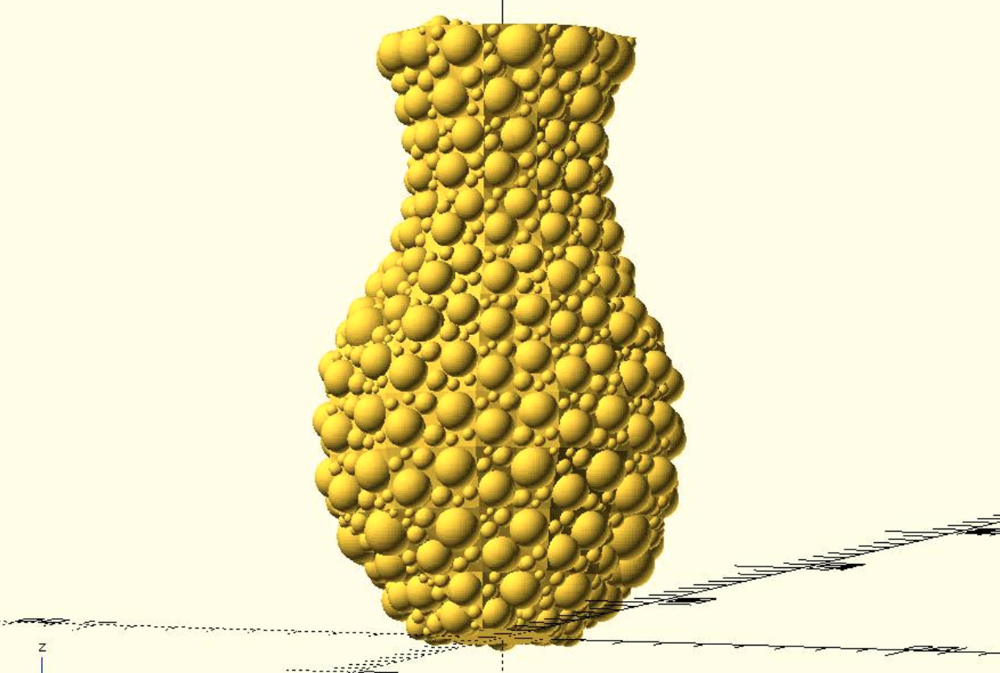
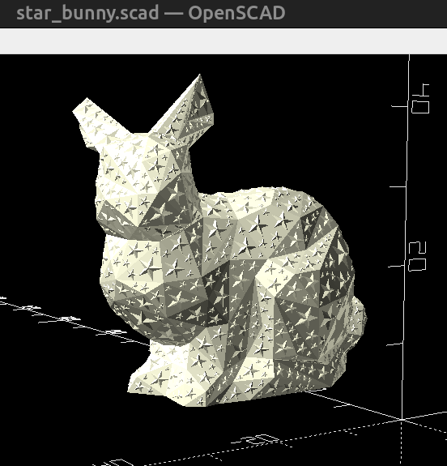
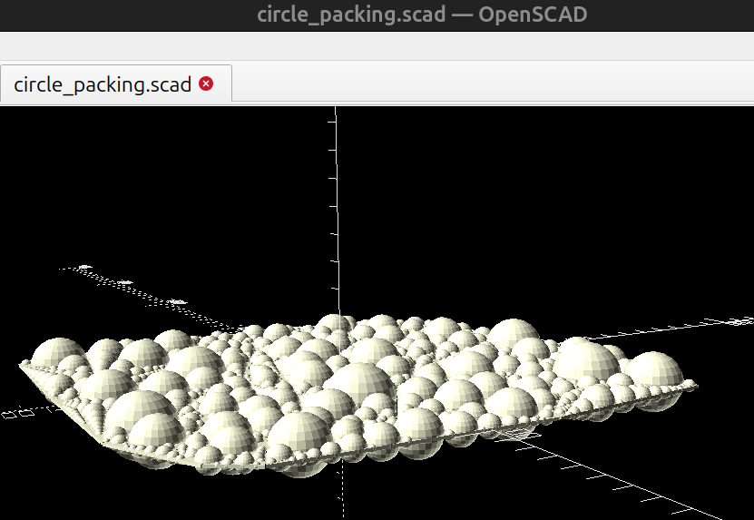
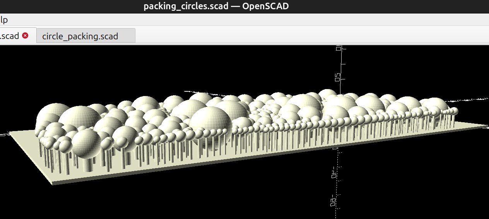

# Preservation 

Hi, my name is Roberto Marquez.  I forked this repository, by Justin Lin (JustinSDK), to preserve and (hopefully) complement his work with some annotations and slight edits.  

[The original Github repository was here.](https://github.com/JustinSDK/dotSCAD)

The edits are mainly to ensure the OpenSCAD script will run and produce a model.

A side quest for making this repository fork is looking for the source code to the folloiwng vase with circle packing:

Inspiration 

That photo is from this [twitter post](
https://x.com/caterpillar/status/1532995677219090432).  I still have not found the source code for the cicle packing vase though.

# The main changes I have made are listed below:

examples/circle_packing/star_bunny.scad

## examples/circle_packing/star_bunny.scad
    Update the 'use' statemetments to include the 'src/' path

## src/experimental/circle_packing.scad

update 'use' statements

                      

## examples/circle_packing/packing_circles.scad

update 'use' statements

I think this one is supposed to be 'forest'

## 